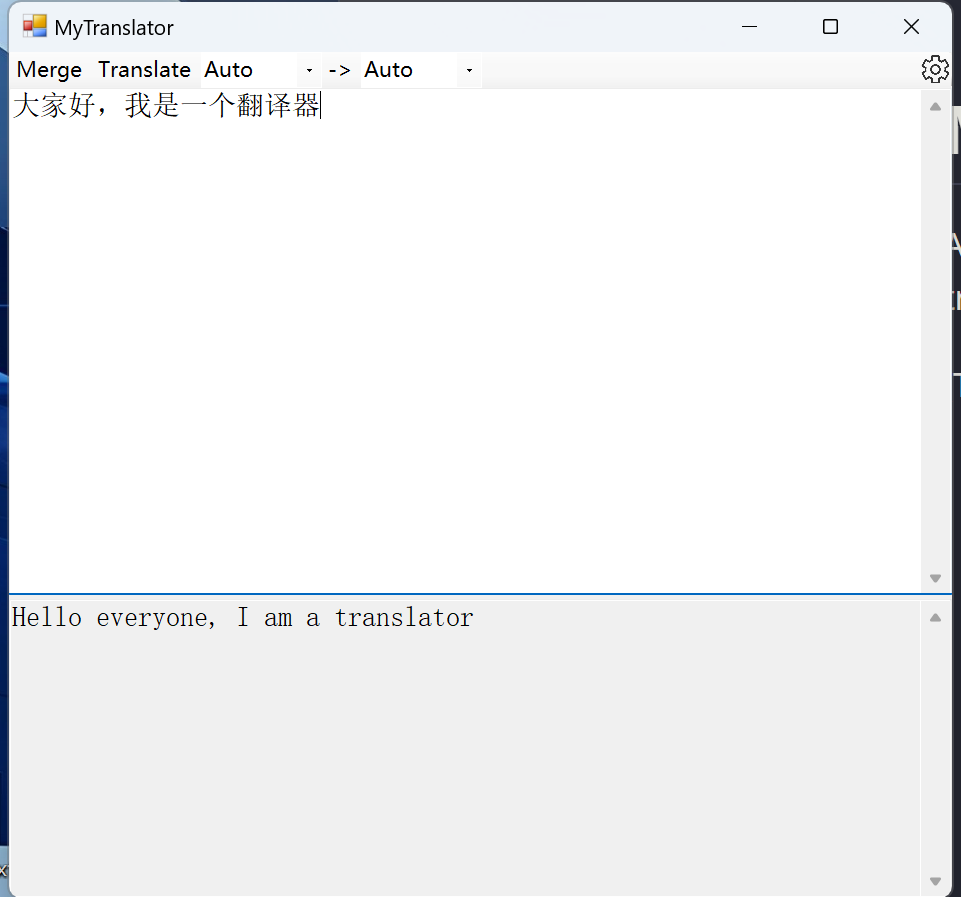

# MyTranslator
A simple winform based Translator which using google translate.

(The project is created based .Net Framwork 4.7.2 )


## GUI




## Config file

We can config proxy in the config file named `my_config.json`：

```json
{
  "ProxySetting": {
      // ProxyType: NoProxy, CustomProxy
    "ProxyType": "CustomProxy",
    "ProxyServerIP": "127.0.0.1",
    "ProxyServerPort": "10809"
  }
}
```

..


## TODO

- Config form...
- More features (I haven't decided yet. 😀)
